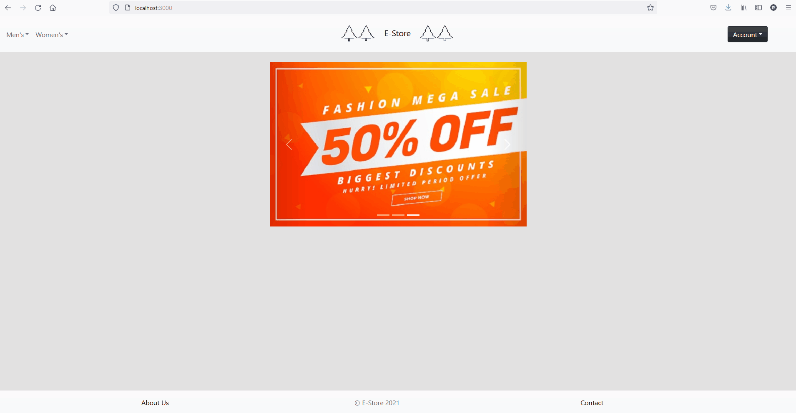

# online-store


I created this project because I wanted to improve my web development skills. Particularly, I wanted to learn React. Most of my time was spent on the frontend of the application and this is reflected in the simplicity of the application. I chose not to implement a payment system because a) I have nothing to sell and b) I was worried about the liability this might expose me to. 

## Description
This is a restful online store built with the MERN stack. The 
general layout of the project is as follows:

* Backend
  * Node 
  * Express middleware handles HTTP requests
  * Mongoose schemas are used to model data (products, sessions, users, promotions)
  * Passport.js to manage session cookies
                  
* Frontend
  * React
  * State is managed with hooks rather than classes
  * Session persistence is implemented with localStorage (no sensitive data is stored here)
  * Axios is used to make HTTP requests
  
* Database
  * mongoDB 
  * Stores user sessions, products, promotions, and users

## Features
* User login and registration
* Add/remove product from cart
* Upload products from admin route

## Install
1. Clone the repo
```
$ git clone https://github.com/ross-m/online-store.git
$ cd online-store
```
2. Start the server
 ```
 $ cd root/Backend
 $ nodemon server.js
 ```
3. Start the front end application
 ```
 $ cd root/Frontend
 $ npm start
 ```
 
## Setup
You'll need to create a .env file in the backend that defines the following variables: 
```
DB_URL (url to connect to mongoDB cluster)
PORT (where the server listens)
ADMIN_KEY (secret key for JWT encryption of an admin)
admin=::1 (restricts the valid IP for an admin)
```
